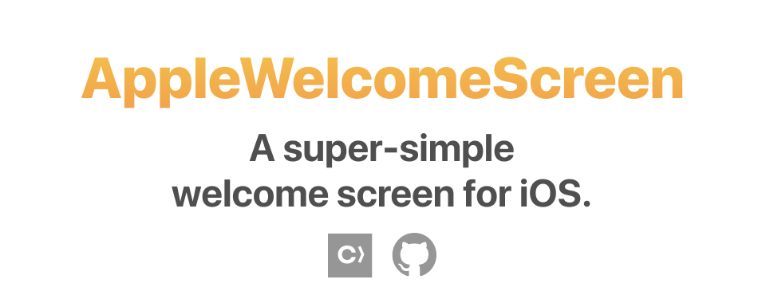
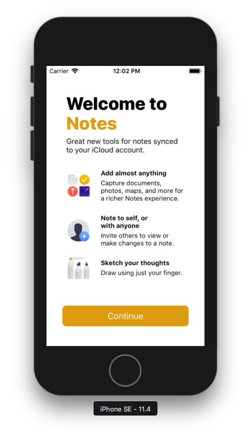
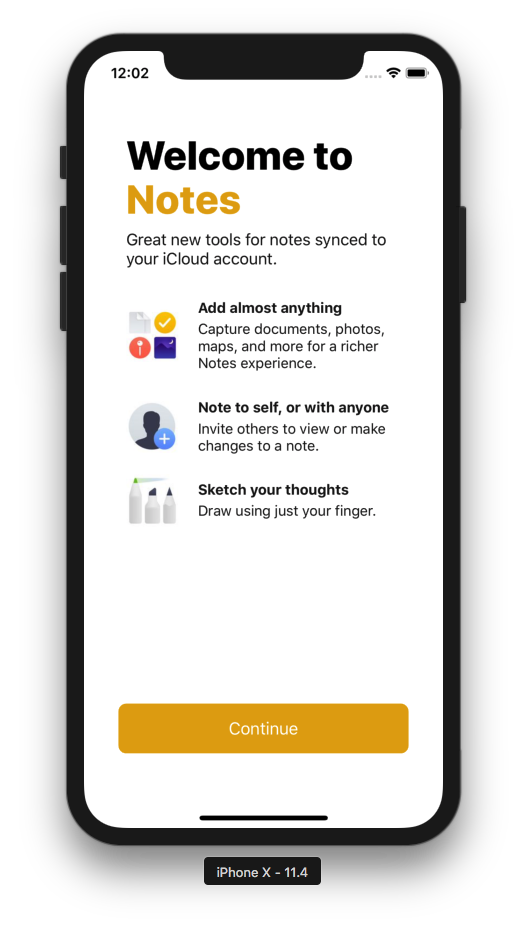
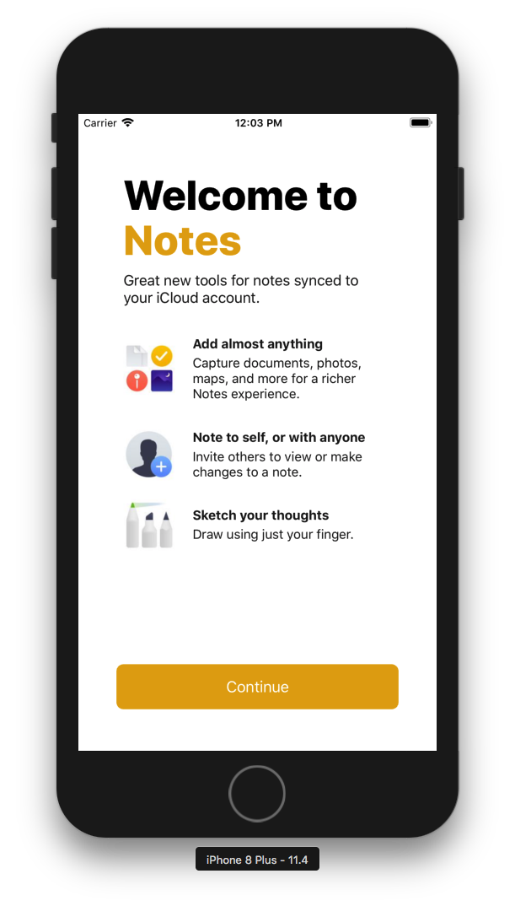

# AppleWelcomeScreen



[](https://cocoapods.org/pods/AppleWelcomeScreen)
[](https://cocoapods.org/pods/AppleWelcomeScreen)
[](https://cocoapods.org/pods/AppleWelcomeScreen)

AppleWelcomeScreen is a super-simple way to create a welcome screen/onboarding experience similar to the ones used in built-in iOS apps. For example, here's the Notes welcome screen recreated using AppleWelcomeScreen:

| iPhone SE | iPhone X | iPhone Plus |
| --- | --- | --- |
|  |  |  |

## Usage

Just provide a configuration and you're good to go:

```swift
var configuration = AWSConfigOptions()

configuration.appName = "AwesomeApp"
configuration.appDescription = "The greatest app ever."
configuration.tintColor = .red

var item1 = AWSItem()
item1.image = UIImage(named: "item1")
item1.title = "Do lots of stuff"
item1.description = "AwesomeApp lets you do tons of awesome stuff."

var item2 = AWSItem()
item2.image = UIImage(named: "item2")
item2.title = "Do even more cool stuff"
item2.description = "We feature hundreds of things to do. Just select one or more features to activate."

var item3 = AWSItem()
item3.image = UIImage(named: "item3")
item3.title = "Better with Pro"
item3.description = "With an AwesomeApp Pro subscription, you'll have even more awesome features to use."

configuration.items = [item1, item2, item3]

configuration.continueButtonAction = {
    self.dismiss(animated: true)
    doAwesomeStuff()
}

let vc = AWSViewController()
vc.configuration = configuration
self.present(vc, animated: true)
```

## Example

To run the example project, clone the repo, and run `pod install` from the Example directory first.

## Installation

AppleWelcomeScreen is available through [CocoaPods](https://cocoapods.org). To install
it, simply add the following line to your Podfile:

```ruby
pod 'AppleWelcomeScreen'
```

## Author

Wilsonator5000, wilsonator5000@gmail.com

## License

AppleWelcomeScreen is available under the MIT license. See the LICENSE file for more info.
